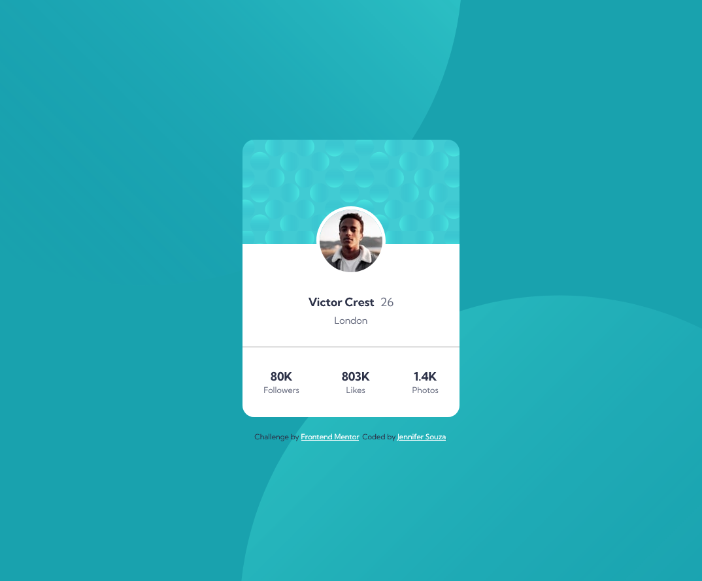

# Frontend Mentor - Profile card component solution

This is a solution to the [Profile card component challenge on Frontend Mentor](https://www.frontendmentor.io/challenges/profile-card-component-cfArpWshJ). Frontend Mentor challenges help you improve your coding skills by building realistic projects. 

## Table of contents

- [Overview](#overview)
  - [The challenge](#the-challenge)
  - [Screenshot](#screenshot)
  - [Links](#links)
- [My process](#my-process)
  - [Built with](#built-with)
  - [What I learned](#what-i-learned)
  - [Continued development](#continued-development)
  - [Useful resources](#useful-resources)
- [Author](#author)

## Overview

### The challenge

- Build out the project to the designs provided

### Screenshot

### Links

- Solution URL: [https://github.com/zoedarkweather/profile-card-component](https://github.com/zoedarkweather/profile-card-component)
- Live Site URL: [https://profile-card-component-pi-five.vercel.app/](https://profile-card-component-pi-five.vercel.app/)

## My process

### Built with

- Semantic HTML5 markup
- CSS custom properties
- Flexbox
- CSS Grid
- Mobile-first workflow

### What I learned
I wanted to try an easier one this time to see how long it would take me to complete, and also just focus on matching the design as close as possible. It was a little bit more challenging than I expected. I had to look up background position and transform translate because I couldn't quite remember the syntax.  And it took me a little bit of time to figure out how to position the background images.

### Continued development
Keep practicing CSS. Practice positioning background images and using transform.

### Useful resources

- [MDN - Background Position](https://developer.mozilla.org/en-US/docs/Web/CSS/background-position) - This helped me with positioning the background images.
- [MDN - translate()](https://developer.mozilla.org/en-US/docs/Web/CSS/transform-function/translate) - This reminded me how to use translate().

## Author

- Github - [Jennifer Souza](https://github.com/zoedarkweather)
- Frontend Mentor - [@zoedarkweather](https://www.frontendmentor.io/profile/zoedarkweather)

